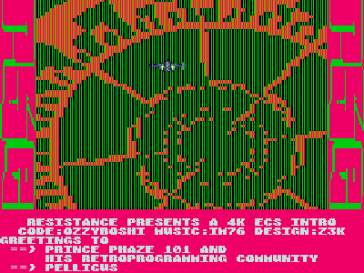

# Planartunnel
Planartunnel is a tiny intro designed for ECS/OCS Amigas.
It features a fake 3D animation of a spaceship flying through a tunnel.

The project started as a personal challenge: I wanted to see if I could create an animation with a small music track, all packed into a 4KB executable.

Planartunnel was also the subject of a short video series on the Phaze 101 Twitch channel, where I appeared as a guest to walk through the key stages of development.

The final version was released at the Posadas Demoparty 2025, where it placed second (out of two entries).

To build the executable, run the provided Makefile.
You'll need Shrinkler and vasm installed.
If everything goes well, the final binary should be 4072 bytes in size.

### Credits:
- Code: Ozzyboshi
- Music: IM76
- Direction: Z3K

### Screenshot:

### Thanks:

